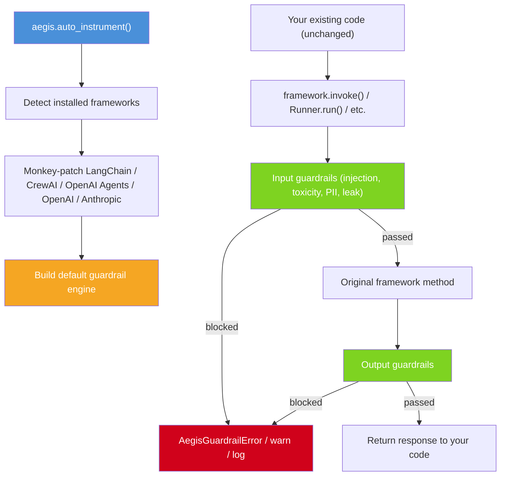
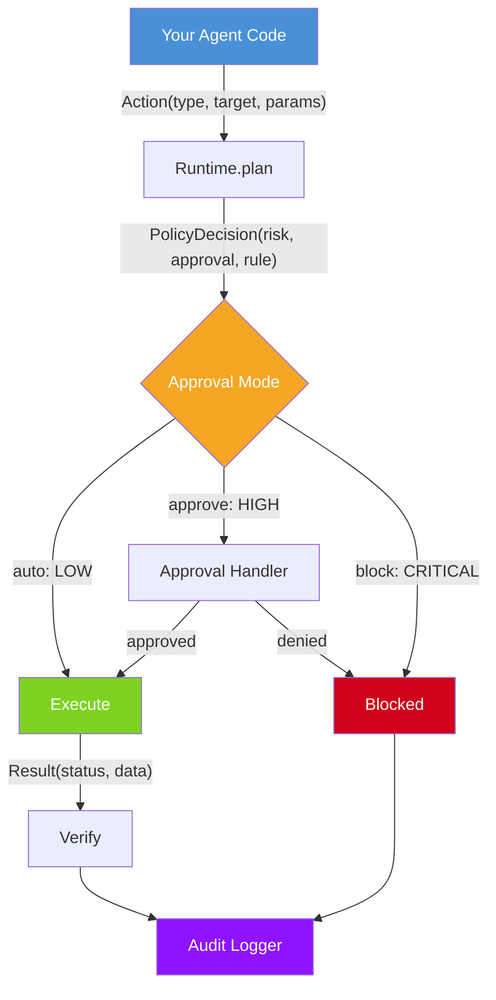
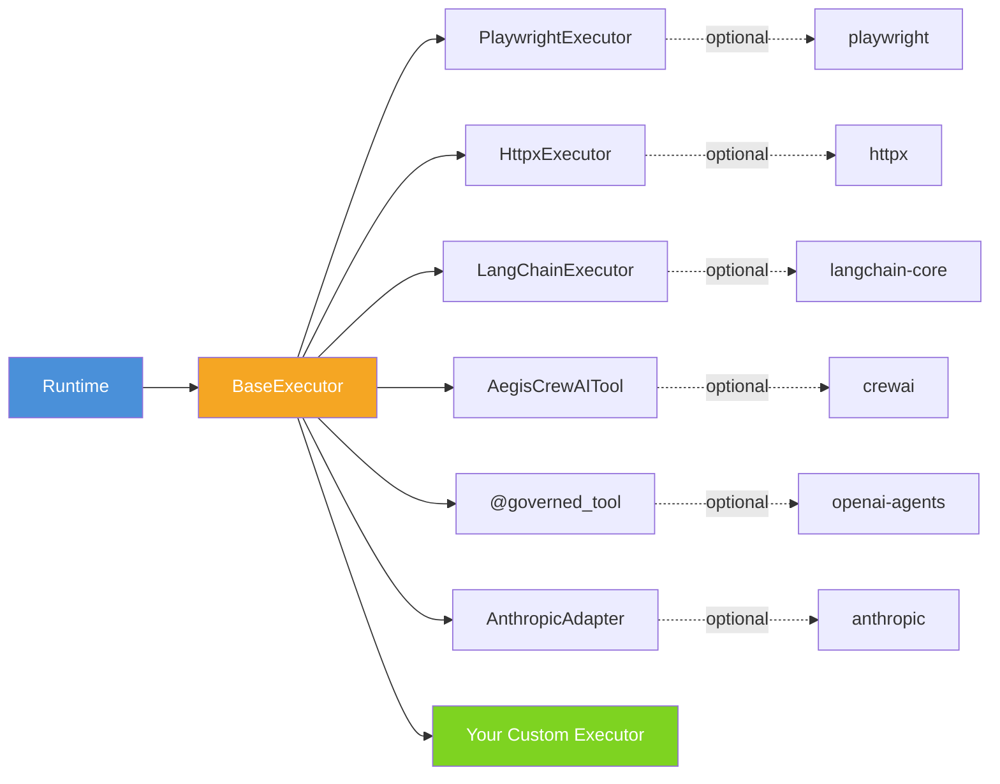
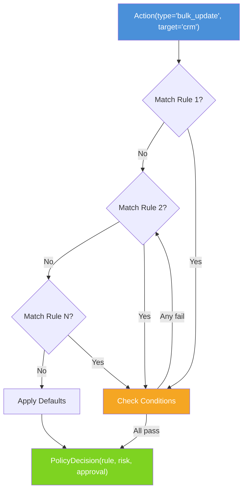
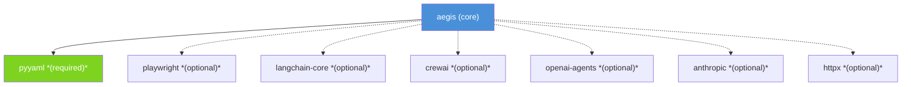

# Architecture

This document describes the high-level design of Aegis.

## Design Philosophy

1. **Policy-first**: Every agent action goes through policy evaluation before execution.
2. **Framework-agnostic**: Core engine has no framework dependencies. Adapters are optional.
3. **Audit everything**: Every decision and result is logged for post-hoc review.
4. **Fail-safe defaults**: Unknown actions default to `medium` risk with `approve` requirement.

## Module Structure

```
src/aegis/
├── instrument/     # Auto-instrumentation (monkey-patching layer)
│   ├── __init__.py      # auto_instrument(), status(), reset()
│   ├── _langchain.py    # Patches BaseChatModel, BaseTool
│   ├── _crewai.py       # Patches Crew.kickoff, BeforeToolCallHook
│   ├── _openai_agents.py # Patches Runner.run, Runner.run_sync
│   ├── _defaults.py     # Default guardrail engine builder
│   └── _state.py        # Thread-safe global instrumentation state
│
├── core/           # Pure data models and policy engine (no I/O)
│   ├── action.py       # Action dataclass
│   ├── risk.py         # RiskLevel enum
│   ├── policy.py       # Policy engine, rules, decisions
│   ├── conditions.py   # Condition evaluators (time, params, weekday)
│   ├── result.py       # Result and status types
│   ├── plan.py         # ExecutionPlan model
│   └── schema.py       # Policy JSON Schema
│
├── guardrails/     # Runtime content guardrails
│   ├── engine.py       # GuardrailEngine pipeline
│   ├── injection.py    # Prompt injection detection
│   ├── pii.py          # PII detection & masking
│   ├── toxicity.py     # Toxicity detection
│   └── prompt_leak.py  # Prompt leak detection
│
├── integrations/   # Zero-code API patching
│   ├── patch_openai.py    # Monkey-patches OpenAI API
│   ├── patch_anthropic.py # Monkey-patches Anthropic API
│   └── decorators.py     # @guard decorator
│
├── adapters/       # Pluggable executors (each with optional deps)
│   ├── base.py         # BaseExecutor ABC
│   ├── playwright.py   # Browser automation
│   ├── httpx_adapter.py # REST API calls
│   ├── langchain.py    # LangChain integration
│   ├── crewai.py       # CrewAI integration
│   ├── openai_agents.py # OpenAI Agents SDK
│   └── anthropic.py    # Anthropic Claude
│
├── runtime/        # Orchestration and side effects
│   ├── engine.py       # Runtime: plan -> approve -> execute -> verify -> audit
│   ├── approval.py     # Approval handlers (CLI, auto)
│   ├── approval_callback.py  # Callback-based approval
│   ├── audit.py        # SQLite audit logger
│   └── audit_logging.py # Python logging audit backend
│
└── cli/            # Command-line interface
    └── main.py         # aegis validate | audit | schema
```

## Data Flow

### Auto-Instrumentation Path (zero-code)



### Policy Engine Path (full control)



## Adapter Architecture



## Policy Evaluation Flow



## Key Design Decisions

### Why first-match-wins for policy rules?
Simpler mental model than priority-based systems. Developers order rules from specific to general, just like firewall rules or CSS selectors.

### Why glob patterns instead of regex?
Globs are familiar, readable, and sufficient for action type/target matching. Regex is available in conditions (`param_matches`) for complex cases.

### Why SQLite for audit?
Zero configuration, works everywhere, queryable. For production log aggregation, use `LoggingAuditLogger` to pipe to existing infrastructure.

### Why monkey-patching for auto-instrumentation?
The same pattern used by OpenTelemetry (tracing), Sentry (error tracking), and datadog-trace (APM). It provides zero-code governance -- users add one line and all existing AI calls are governed without refactoring. All patches are reversible via `reset()`, idempotent, and skip cleanly if a framework is not installed.

### Why lazy imports for adapters?
Each adapter has heavy optional dependencies (playwright, langchain-core, etc.). Lazy imports ensure `import aegis` is fast and the core has no heavy deps.

### Why async-first?
AI agent frameworks are predominantly async. Sync wrappers are trivial to add, but async-first avoids event loop issues.

## Dependency Graph



## Testing Strategy

- Unit tests for core (policy, actions, conditions) — no I/O
- Integration tests for runtime (in-memory SQLite, fake executors)
- Import guard tests for each adapter (verify graceful error without optional deps)
- CLI tests using capsys and tmp_path fixtures
