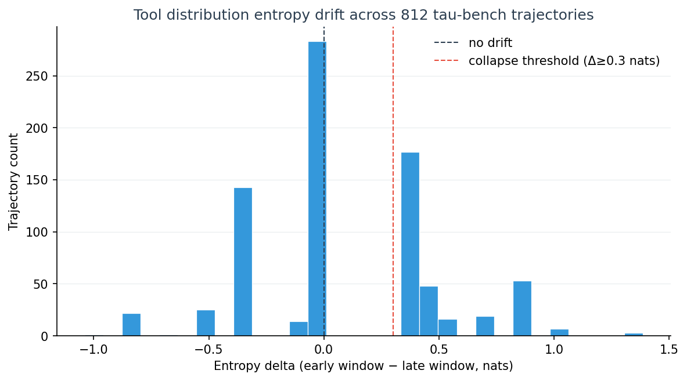
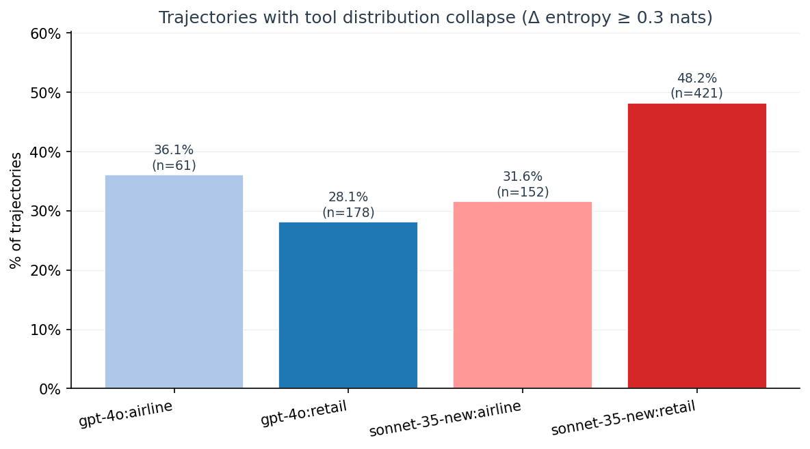
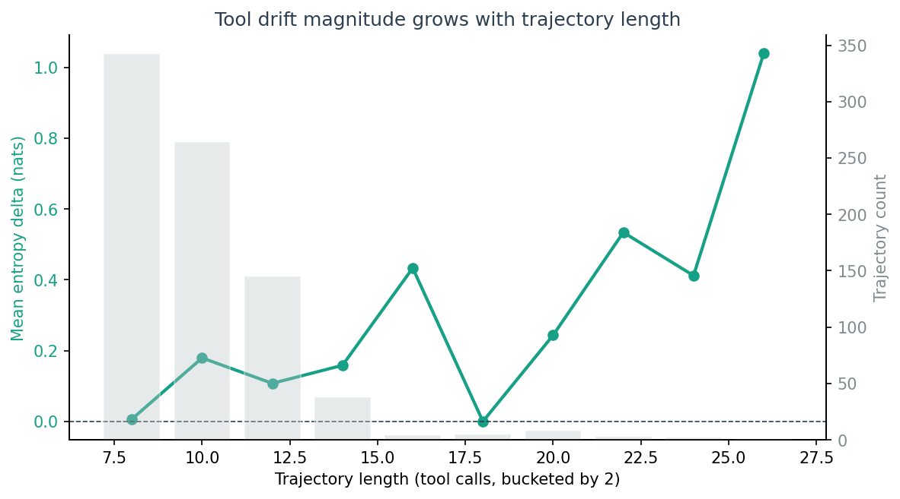
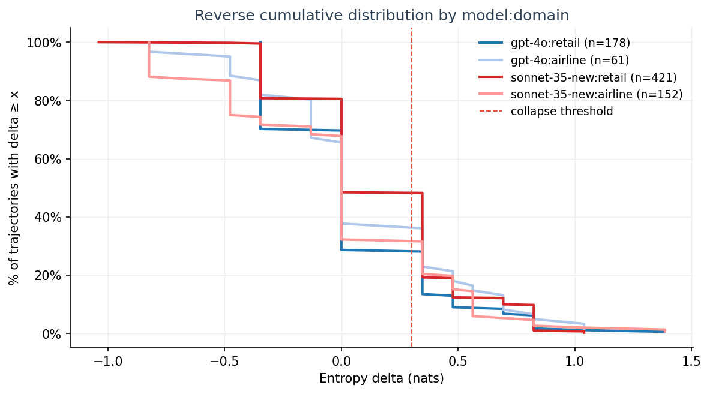

# Tool Distribution Drift in 1,960 Tau-Bench Agent Trajectories

**TL;DR.** We ran an entropy-based tool distribution drift detector across 1,960 tau-bench customer-service agent trajectories (GPT-4o + Sonnet 3.5 New, retail + airline). 39.8% of trajectories with ≥8 tool calls show measurable collapse (Δ entropy ≥ 0.3 nats); 12.1% collapse hard (Δ ≥ 0.5 nats). The signal is bimodal — agents either stay open or fall off a cliff. Sonnet 3.5 New on retail tasks collapses 1.7× more than GPT-4o on the same task family.

This post is the result of running [Aegis](https://github.com/Acacian/aegis)'s entropy-based drift detector (`src/aegis/core/drift.py`) over the public [sierra-research/tau-bench historical_trajectories](https://github.com/sierra-research/tau-bench/tree/main/historical_trajectories) dataset. All measurement code, raw data, and chart-generation scripts are linked at the bottom.

## What we measured

For each tau-bench trajectory we extracted the ordered tool call sequence (think · find_user · get_order_details · …) and computed Shannon entropy of the tool name distribution over two non-overlapping windows:

- **early window** = the first 4 tool calls
- **late window** = the last 4 tool calls
- **drift** = `entropy(early) − entropy(late)` (positive means the tool mix narrowed over time)
- **collapse threshold** = drift ≥ 0.3 nats (≈ 26% of `log 4`, the maximum possible entropy of a 4-call window)

We restricted analysis to trajectories with ≥8 calls (to leave room for two non-overlapping windows). That left **812 of 1,960 trajectories** scorable.

## Finding 1: drift is bimodal — agents either stay open or fall off a cliff



The distribution has two modes: a tall bar near zero (no drift, the agent maintained tool diversity through the full task) and a second peak around Δ = 0.4 (a hard collapse, the agent narrowed onto one or two tools by the end). Almost no trajectories sit in the "gradual decline" middle. **An agent either holds its exploration breadth or it doesn't**.

## Finding 2: model and domain matter, and the gap is large



| Model:domain | Trajectories scored | Collapse rate (Δ ≥ 0.3) |
|---|---|---|
| **sonnet-35-new : retail** | 421 | **48.2 %** |
| gpt-4o : airline | 61 | 36.1 % |
| sonnet-35-new : airline | 152 | 31.6 % |
| gpt-4o : retail | 178 | 28.1 % |

On the **same retail task family**, Sonnet 3.5 New collapses on 48.2 % of trajectories versus GPT-4o's 28.1 %. That's 1.7×, on n = 599 combined trajectories.

We are **not** claiming "Sonnet is worse." Customer-service tasks reward narrowing — once the agent has located the user and the order, the remaining steps converge on a small set of fulfilment tools. What the data shows is that *the convergence is sharper and earlier in Sonnet*. Whether that is a feature (decisive execution) or a failure mode (premature commitment) is task-dependent.

## Finding 3: drift magnitude grows with trajectory length



Mean entropy delta climbs from ≈ 0 nats at length 8 to ≈ +0.6 nats at length 26+. Longer trajectories drift more in absolute terms — which is consistent with both interpretations:

- (a) Long tasks legitimately need to converge; the late window samples a fulfilment-heavy phase.
- (b) Long tasks expose agents to more compounding pressure to reuse the most recently-successful tool.

The reverse cumulative chart sharpens the per-group picture:



The Sonnet retail curve sits visibly above the others all the way out to Δ ≈ 1.0. Across the entire upper tail, Sonnet retail trajectories are more likely to be in collapse than any other group.

## Three trajectories, in their own words

### Full collapse (Δ = +1.386 nats, gpt-4o:retail:t0347)
```
early window:  find_user_id_by_name_zip → list_all_product_types →
               get_product_details → get_user_details
late window:   get_order_details → get_order_details →
               get_order_details → get_order_details
```
Entropy went from `log 4 = 1.386` (perfectly uniform) to `0.0` (one tool, four times). The agent moved from open exploration to a single-tool loop within 8 calls.

### Mid collapse (Δ = +0.477 nats, gpt-4o:retail:t0279)
```
early window:  find_user_id_by_name_zip → get_user_details →
               get_order_details → get_order_details
late window:   get_order_details → get_order_details →
               get_order_details → exchange_delivered_order_items
```
Two distinct early tools, one dominant late tool, one fulfilment action — the canonical retail customer-service shape.

### Stable (Δ = +0.000 nats, sonnet-35-new:retail:t0441)
```
early window:  find_user_id_by_name_zip → get_user_details →
               get_order_details → get_order_details
late window:   get_product_details → think → exchange_delivered_order_items →
               think
```
Tool diversity preserved across the trajectory. This is the shape that **doesn't** trigger our collapse alert.

## Why measure this at all?

A drifting tool distribution is not a bug by itself, and we are explicit about not claiming otherwise. But it is one of the few signals you can compute on a tool-call trace that simultaneously satisfies four properties most existing approaches give up at least one of:

### 1. Deterministic (no LLM-as-judge)
The entire pipeline is `Counter`, `log`, and `mean`. No second model judges the first model. No fine-tuned classifier. No retraining. Two runs on the same trace produce bit-identical results — which means we can compare GPT-4o output today to Sonnet output tomorrow without worrying that the *evaluator* drifted between runs.

Most agent-quality work today uses LLM-as-judge ([Patronus](https://www.patronus.ai/), Braintrust, DeepEval style), or fine-tuned classifiers ([Galileo](https://www.galileo.ai/), [Maxim](https://www.getmaxim.ai/)). Both add a second source of variance. Entropy doesn't.

### 2. Privacy-preserving (tool names only)
The score function only reads `tool_name`. Arguments, chain-of-thought text, user prompts, and system prompts can all stay on the agent's machine. This means:

- Enterprise users can run drift detection on prod traces without exfiltrating PII or proprietary prompts.
- The detector can be embedded in `auto_instrument()` middleware that streams a 1-byte-per-call summary instead of full trace bodies.
- Public benchmarking is honest — we are not silently leaking the evaluation set into a hosted API.

LLM-judge tools by definition need to read the actual conversation; they can't offer this property at all.

### 3. Cross-model comparable
Because the metric is computed on the trace alone, GPT-4o and Sonnet produce numbers on the same scale (`Δ ∈ [-log W, +log W]`, normalised to `[-1, +1]` against `log W`). The Sonnet-retail vs GPT-4o-retail comparison earlier in this post (1.7× collapse rate) is only possible *because* the metric is model-agnostic.

Most published agent benchmarks measure single-model accuracy on a fixed test set ("our agent solves X% of HumanEval"). They cannot tell you whether a *different* model on the *same* trajectory behaved differently — and that's the question buyers actually have when picking between Sonnet and GPT-4o.

### 4. 30-second reproducible
The entire measurement pipeline (loader + scorer + group aggregator) is **120 lines of stdlib-only Python**. No numpy, no pandas, no sklearn. The dataset is public ([sierra-research/tau-bench](https://github.com/sierra-research/tau-bench/tree/main/historical_trajectories)). The scripts are linked at the bottom of this post. From `git clone` to regenerated charts takes about 30 seconds on a laptop.

This matters because most "we measured X" claims in the agent space either ship the numbers without code, ship code without data, or require GPU infrastructure to reproduce. We took ~3 hours of compute on a CPU laptop.

### What it doesn't do
- It does not say *why* the agent collapsed.
- It does not say whether the collapse caused the task to fail.
- It does not work on a single tool call — you need at least 8.

Our prior hypothesis ("CoT cardinal numbers near action verbs are extractable as a drift signal") was killed by the same dataset at a 2.3 % hit rate. The entropy-on-tool-names approach survives where the regex-on-thoughts approach didn't, *because* it satisfies all four properties above.

## Reproduce in 30 seconds

```bash
git clone https://github.com/Acacian/aegis
cd aegis
pip install -e .
# (download tau-bench historical trajectories — see scripts/convert_tau_bench.py)
python scripts/analyze_drift_on_tau_bench.py \
    --input .cache/traces/tau_bench_all.jsonl \
    --output .cache/analysis/drift_results.json \
    --window-size 4 --min-calls 8
python scripts/visualize_drift_results.py
```

This will regenerate every number and chart in this post.

## Try the detector on your own agent

```python
import aegis
from aegis.core.drift import DriftDetector, DriftType

detector = DriftDetector()
# Feed it the BehaviorProfile produced by aegis.auto_instrument()
# or build one from your own trace.
result = detector.check(agent_id="my-agent", metric_name=DriftType.TOOL_DISTRIBUTION)
if result.drifted:
    print(f"Tool distribution drifted: Δ={result.delta:+.3f} nats")
```

A CLI wrapper (`aegis check drift --tool-distribution <trace.jsonl>`) lands in v0.9.4, due immediately after this post.

## Methodology notes & limitations

- **Single-task framing.** Each tau-bench `tXXXX` is one customer task. We treat the full call sequence as one trajectory and ignore turn boundaries inside a conversation. Multi-task agents would need a different windowing strategy.
- **Window choice.** W = 4 is the smallest window that keeps `log W = 1.386` enough resolution to detect 0.3-nats moves. Larger W (8, 16) makes collapse harder to detect because window-internal averaging smooths the signal; smaller W is too noisy.
- **Cause attribution is out of scope.** We do not claim that tool distribution collapse causes task failure. We only show that the signal exists, varies systematically by model and task family, and is cheap to compute.
- **Sonnet 3.5 New ≠ Sonnet 4.5/4.6.** The tau-bench dataset shipped with Sonnet 3.5 New. Numbers may differ on more recent Sonnet checkpoints.
- **n is not enormous.** 812 scorable trajectories is enough to see directional differences but not enough for statistical significance claims at the per-tool level. Treat the percentages as descriptive, not inferential.

## Data and code

- Measurement script: `.claude/scripts/analyze_drift_on_tau_bench.py`
- Visualization script: `.claude/scripts/visualize_drift_results.py`
- Drift detector source: `src/aegis/core/drift.py` (Aegis core)
- Raw tau-bench data: [sierra-research/tau-bench historical_trajectories](https://github.com/sierra-research/tau-bench/tree/main/historical_trajectories)
- Aegis repo: [github.com/Acacian/aegis](https://github.com/Acacian/aegis)

If you want the per-trajectory JSON (812 rows × 13 columns), open an issue on the repo.
